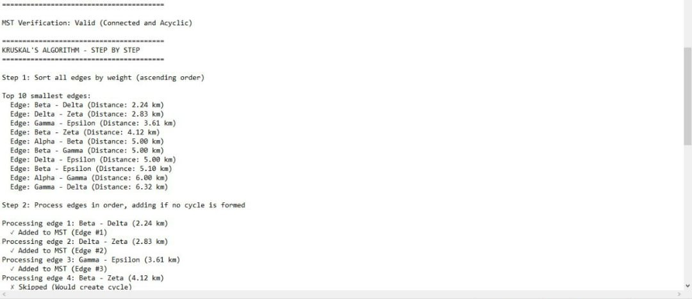
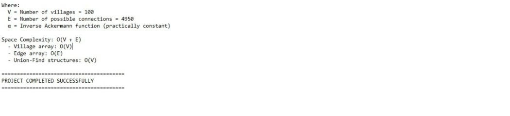
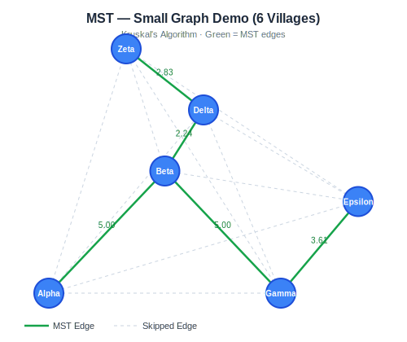
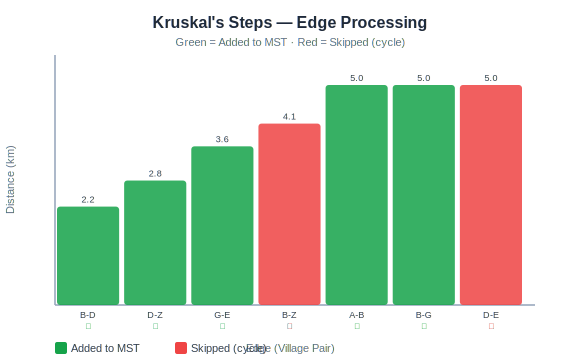
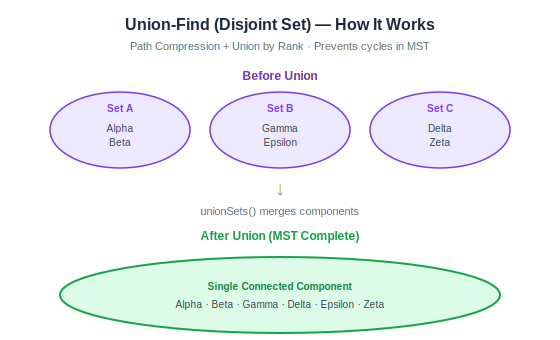
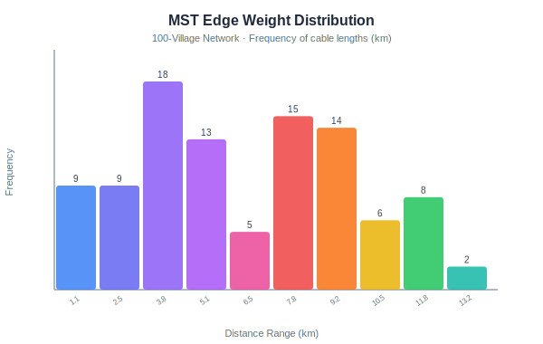
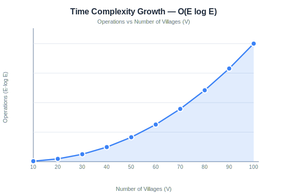

# MST Rural Internet Connectivity — Kruskal's Algorithm

A C++ implementation of Kruskal's Minimum Spanning Tree algorithm applied to a rural internet connectivity problem. Villages are modeled as graph vertices and cable connections as weighted edges (Euclidean distance).

---

## Project Output Screenshots

### Console Output — Small Graph Demo


### Console Output — Kruskal's Step-by-Step


### Console Output — Large Network (100 Villages)


### Console Output — Complexity Analysis


---

## Visualizations

### MST — Small Graph (6 Villages)
Shows all edges (dashed = skipped, green = MST) with Euclidean distances labeled.



---

### Kruskal's Steps — Edge Processing
Each bar is one edge processed. Green = added to MST, Red = skipped (would form a cycle).



---

### Union-Find (Disjoint Set) — How It Works
Illustrates how separate components merge into one connected MST using `unionSets()`.



---

### MST Edge Weight Distribution (100-Village Network)
Histogram of cable lengths in the final MST — shows most connections are short-range.



---

### Time Complexity Growth — O(E log E)
Plots the number of operations as village count grows from 10 to 100.



---

## How to Compile and Run

```bash
# Compile
g++ -std=c++11 -o mst_network main.cpp

# Run
./mst_network
```

## Output

- Console: step-by-step demo on 6-vertex graph + full MST stats + complexity analysis
- `mst_results.csv`: all MST edges with village names and distances

---

## File Structure

```
MST/
├── main.cpp              # Entry point — UnionFind, VillageNetwork, Kruskal's
├── villages.csv          # 1000-village dataset (x, y coordinates)
├── mst_results.csv       # Output MST edges from 100-village run
├── screenshotoutput/     # Console screenshots + generated charts
└── README.md
```

---

## Dataset

Self-generated using random coordinates (seed=42 for reproducibility).
Villages have (x, y) positions in a 100×100 unit grid.
Edge weights = Euclidean distance between village pairs.

---

## Algorithm: Kruskal's

Chosen because:
- Works naturally with an edge list
- Clear O(E log E) complexity dominated by sorting
- Union-Find makes cycle detection simple and efficient

### Complexity

| Component         | Complexity     |
|-------------------|----------------|
| Sort edges        | O(E log E)     |
| Union-Find ops    | O(E · α(V))    |
| Overall           | O(E log E)     |
| Space             | O(V + E)       |

Where V = villages, E = V(V-1)/2 possible edges, α = inverse Ackermann (practically constant).
